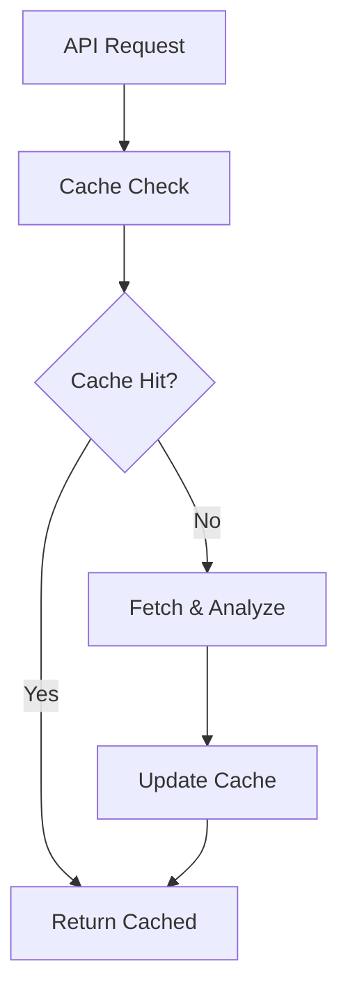
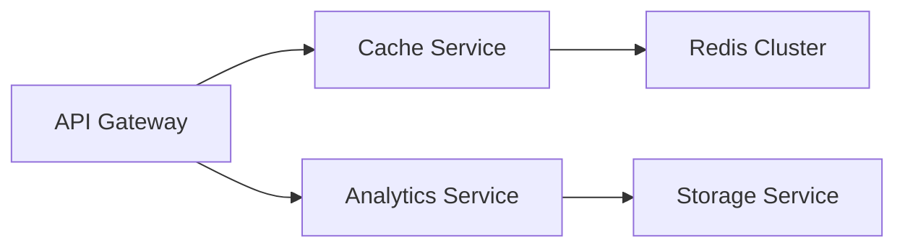

# Architecture and API Integration Plan

## Executive Summary
This document outlines the strategy to integrate our new architecture improvements with the existing API optimization initiatives, ensuring a cohesive and efficient system upgrade path.

## Integration Strategy

### 1. Unified Caching Architecture
Combine the proposed Redis caching approaches:

```python
class UnifiedCacheManager:
    def __init__(self):
        self.redis_client = None
        self.memory_cache = {}
        self.cache_ttl = {
            'profile': 3600,     # 1 hour
            'contests': 1800,    # 30 minutes
            'submissions': 300,  # 5 minutes
            'analysis': 1800     # 30 minutes
        }
```

- **L1 Cache**: In-memory for fastest access (from architecture plan)
- **L2 Cache**: Redis for distributed caching (from API plan)
- **L3 Cache**: Persistent storage for analysis results

### 2. Enhanced Data Pipeline
Merge the background sync service with the new analytics pipeline:

```python
class EnhancedDataPipeline:
    def __init__(self):
        self.cache_manager = UnifiedCacheManager()
        self.analytics_manager = AnalyticsManager()
        self.sync_service = DataSyncService()
        
    async def process_user_data(self, username: str):
        # Coordinated data fetching and analysis
        data = await self.sync_service.get_latest_data(username)
        analysis = await self.analytics_manager.analyze(data)
        await self.cache_manager.store_results(username, analysis)
```

### 3. Consolidated Monitoring
Implement a unified monitoring system that covers both architectural and API metrics:

```python
class UnifiedMonitoring:
    def __init__(self):
        self.prometheus_client = PrometheusClient()
        self.metrics = {
            'api': APIMetrics(),
            'cache': CacheMetrics(),
            'analysis': AnalysisMetrics()
        }
```

## Implementation Phases

### Phase 1: Foundation (Weeks 1-4)
1. Set up unified caching infrastructure
2. Implement basic monitoring
3. Deploy containerization basics

### Phase 2: Core Services (Weeks 5-8)
1. Migrate to enhanced data pipeline
2. Implement GraphQL query batching
3. Deploy Redis cluster

### Phase 3: Advanced Features (Weeks 9-12)
1. Roll out background sync
2. Implement advanced monitoring
3. Deploy Kubernetes infrastructure

## Critical Integration Points

### 1. Data Flow


### 2. Service Communication


## Technical Dependencies
1. Redis 6.2+ for caching
2. Kubernetes 1.21+ for orchestration
3. Prometheus/Grafana for monitoring
4. Python 3.9+ for async support

## Risk Mitigation

### 1. Data Consistency
- Implement cache invalidation patterns
- Use distributed locks for concurrent updates
- Regular cache-to-storage synchronization

### 2. Performance
- Gradual feature rollout
- Performance testing at each phase
- Automated rollback procedures

### 3. Reliability
- Circuit breakers for external services
- Retry mechanisms with exponential backoff
- Fallback to degraded service modes

## Success Metrics

### 1. Performance Targets
- API response time < 200ms (95th percentile)
- Cache hit rate > 80%
- Analysis completion < 2s

### 2. Reliability Targets
- System uptime > 99.9%
- Error rate < 1%
- Zero data loss incidents

## Resource Requirements
1. Infrastructure
   - Kubernetes cluster
   - Redis cluster
   - Monitoring stack

2. Team
   - 1 Lead Engineer
   - 2 Backend Engineers
   - 1 DevOps Engineer

## Next Steps
1. Review and approve integration plan
2. Set up development environment
3. Begin Phase 1 implementation
4. Schedule weekly progress reviews

## Documentation Requirements
1. API Documentation
   - GraphQL schema
   - Query examples
   - Rate limits

2. Operations Documentation
   - Deployment procedures
   - Monitoring setup
   - Troubleshooting guides

This integration plan ensures a smooth transition from the current system to the enhanced architecture while maintaining service stability and improving overall system performance.