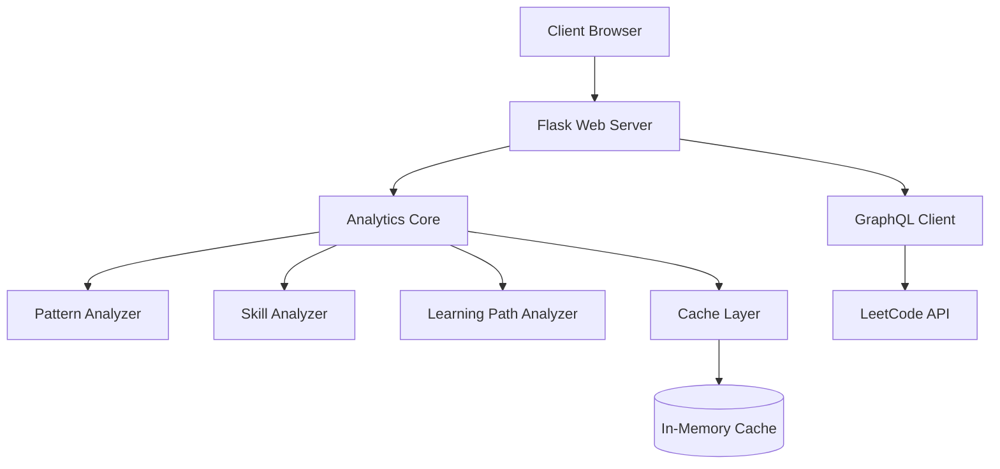
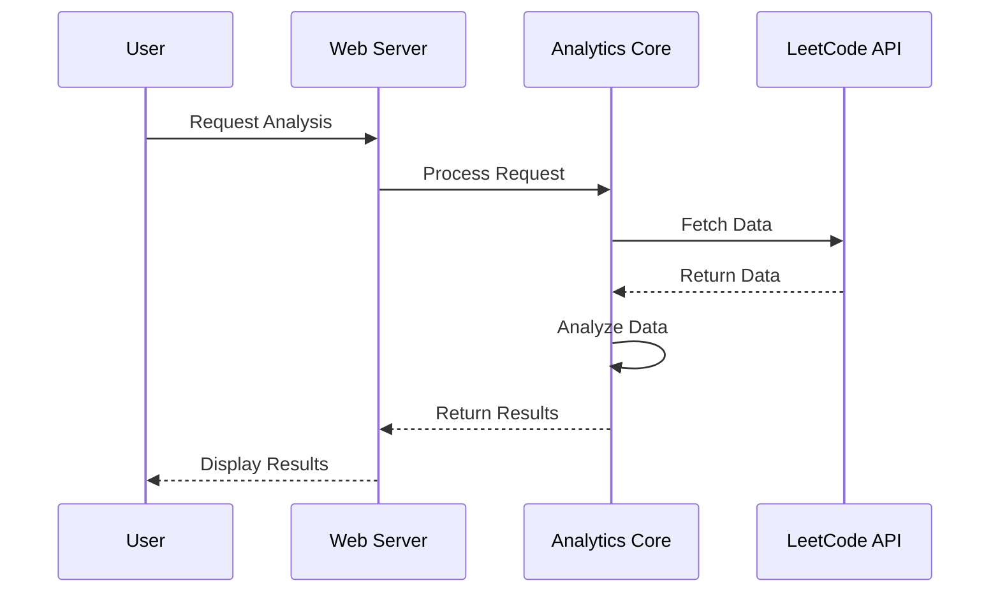
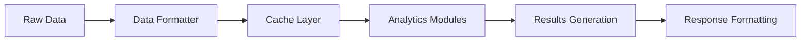

# Architecture Overview

## System Architecture

The AI Analysis for LeetCode project follows a modular architecture designed for scalability and maintainability.



## Core Components

### 1. Web Server (api/app.py)
- Flask-based web application
- Handles HTTP requests and responses
- Serves the web interface
- Routes requests to appropriate analytics modules

### 2. Analytics Core (api/core/analytics/)
The analytics core consists of several specialized modules:

#### Pattern Analyzer (pattern_analyzer.py)
- Analyzes problem-solving patterns
- Identifies strengths and weaknesses
- Tracks progress over time
- Generates pattern-based insights

#### Skill Analyzer (skill_analyzer.py)
- Evaluates technical skills
- Maps problems to skill categories
- Measures proficiency levels
- Suggests skill improvement areas

#### Learning Path Analyzer (learning_path_analyzer.py)
- Creates personalized learning paths
- Recommends problems based on skill level
- Adapts recommendations based on progress
- Optimizes learning trajectory

### 3. Data Management

#### GraphQL Client (api/GQLQuery.py)
- Manages LeetCode API interactions
- Handles authentication
- Implements rate limiting
- Formats API responses

#### Data Formatter (api/data_formatter.py)
- Transforms raw API data
- Standardizes data structures
- Prepares data for analysis
- Handles data validation

#### Cache Layer (api/core/utils/cache.py)
- Implements in-memory caching
- Reduces API calls
- Improves response times
- Manages cache invalidation

## Data Flow

1. **Request Flow**


2. **Analysis Pipeline**


## Technical Stack

### Backend
- Python 3.8+
- Flask web framework
- GraphQL client
- NumPy/Pandas for data processing
- In-memory caching

### Frontend
- HTML/CSS templates
- JavaScript for interactivity
- Bootstrap for responsive design

## Security Considerations

1. **API Security**
   - Rate limiting implementation
   - Request validation
   - Error handling

2. **Data Protection**
   - Secure data transmission
   - Cache expiration policies
   - No storage of sensitive data

## Performance Optimization

1. **Caching Strategy**
   - In-memory cache for frequent requests
   - Configurable cache duration
   - Smart cache invalidation

2. **Request Optimization**
   - Batch API requests
   - Parallel processing where applicable
   - Response compression

## Future Scalability

1. **Horizontal Scaling**
   - Stateless application design
   - Containerization support
   - Load balancer ready

2. **Modular Design**
   - Pluggable analytics modules
   - Extensible architecture
   - Easy integration of new features

## Development Workflow

1. **Code Organization**
```
ai-analysis-for-leetcode/
├── api/
│   ├── app.py
│   ├── GQLQuery.py
│   ├── data_formatter.py
│   └── core/
│       ├── analytics/
│       │   ├── pattern_analyzer.py
│       │   ├── skill_analyzer.py
│       │   └── learning_path_analyzer.py
│       └── utils/
│           └── cache.py
├── docs/
└── tests/
```

2. **Development Process**
   - Feature branching
   - Code review requirements
   - Automated testing
   - Documentation updates